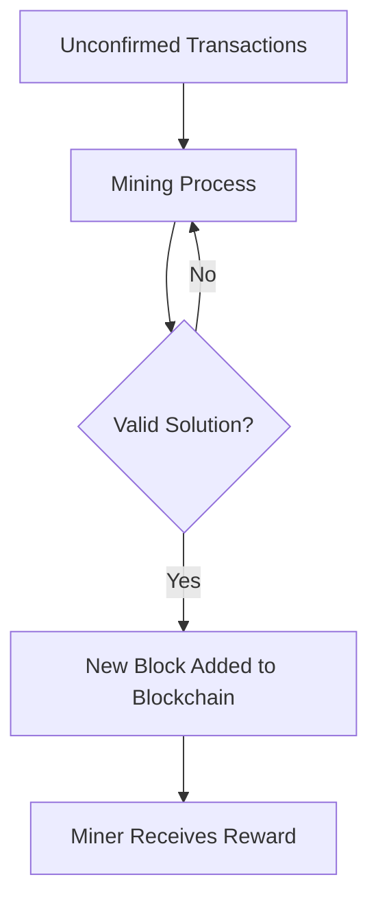
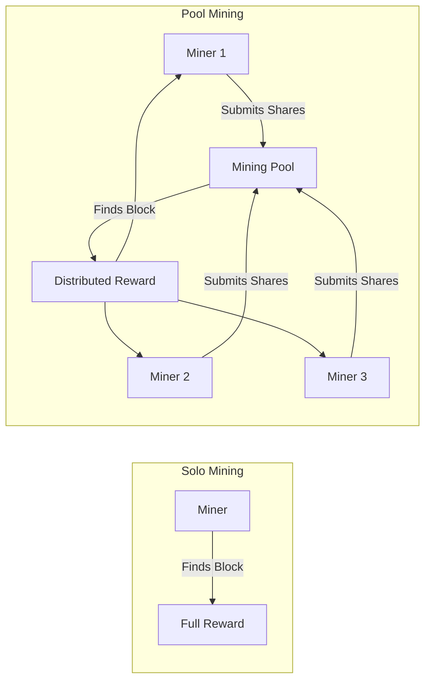
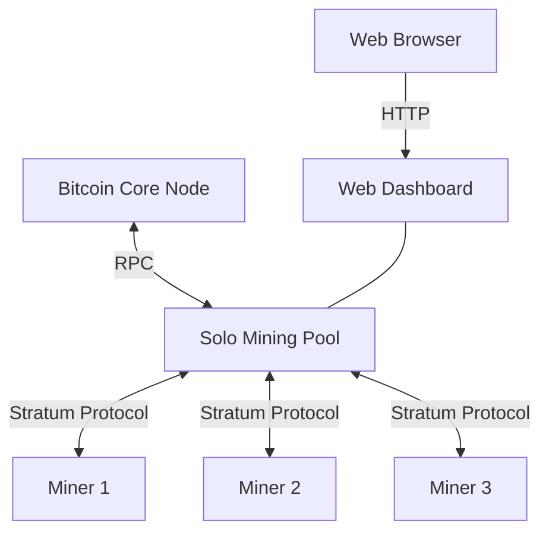

# Introduction to Bitcoin Mining

## What is Bitcoin Mining?

Bitcoin mining is the process of adding new transactions to the Bitcoin blockchain by solving complex mathematical puzzles. These puzzles require significant computational power to solve, and the first miner to find a valid solution is rewarded with newly created bitcoins and transaction fees.

### The Mining Process in Detail

1. **Transaction Collection**: Miners collect unconfirmed transactions from the network.
2. **Block Creation**: Miners create a candidate block containing these transactions.
3. **Proof-of-Work**: Miners repeatedly modify a small portion of the block (the nonce) and calculate the block's hash until they find a hash that meets the network's difficulty target.
4. **Block Propagation**: When a valid solution is found, the miner broadcasts the block to the network.
5. **Verification and Reward**: Other nodes verify the solution, and if valid, the miner receives the block reward.

## Solo Mining vs. Pool Mining

### Solo Mining

In solo mining, a miner works independently to find valid blocks. The miner receives the full block reward when successful but may go long periods without finding any blocks due to the high difficulty of the Bitcoin network.

### Pool Mining

In pool mining, multiple miners combine their computational resources to increase their chances of finding blocks. When a block is found, the reward is distributed among participants based on their contributed work (shares).

## The Role of a Mining Pool

A mining pool serves several critical functions:

1. **Job Distribution**: The pool provides mining jobs to connected miners.
2. **Share Validation**: The pool validates shares submitted by miners to track their contribution.
3. **Block Submission**: When a valid block is found, the pool submits it to the Bitcoin network.
4. **Reward Distribution**: The pool distributes rewards based on miners' contributions.
5. **Statistics and Monitoring**: The pool tracks and displays performance metrics.

### Solo Mining Pool

This project implements a **solo mining pool**, which is a hybrid approach:
- It uses the pool protocol to coordinate multiple miners
- All rewards go to a single Bitcoin address
- No complex reward distribution is needed

## Code References

In our implementation, the main components can be found in:

- `solo_pool.py`: The entry point that initializes all components
- `stratum.py`: Implements the Stratum protocol for miner communication
- `bitcoin_rpc.py`: Communicates with the Bitcoin Core node
- `mining_utils.py`: Contains utilities for creating mining jobs and validating shares

## Next Steps

Now that you understand the basic concepts of Bitcoin mining and mining pools, let's explore the [System Architecture](02-system-architecture.md) of our implementation in more detail.
