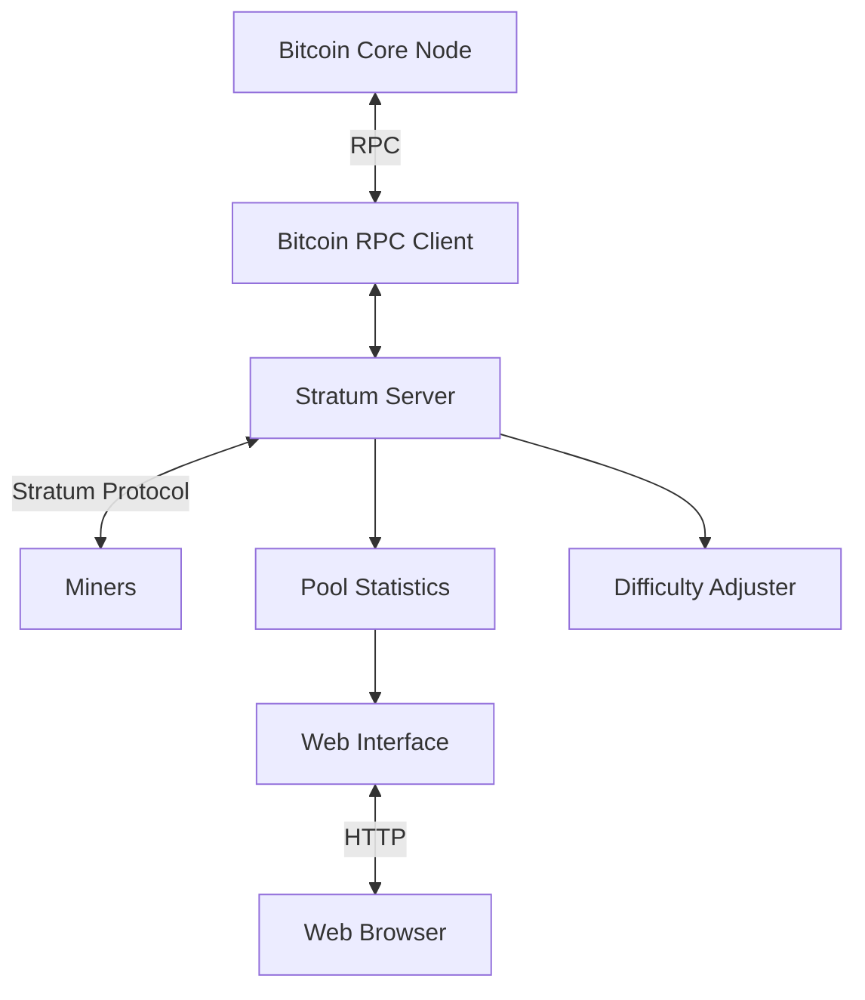
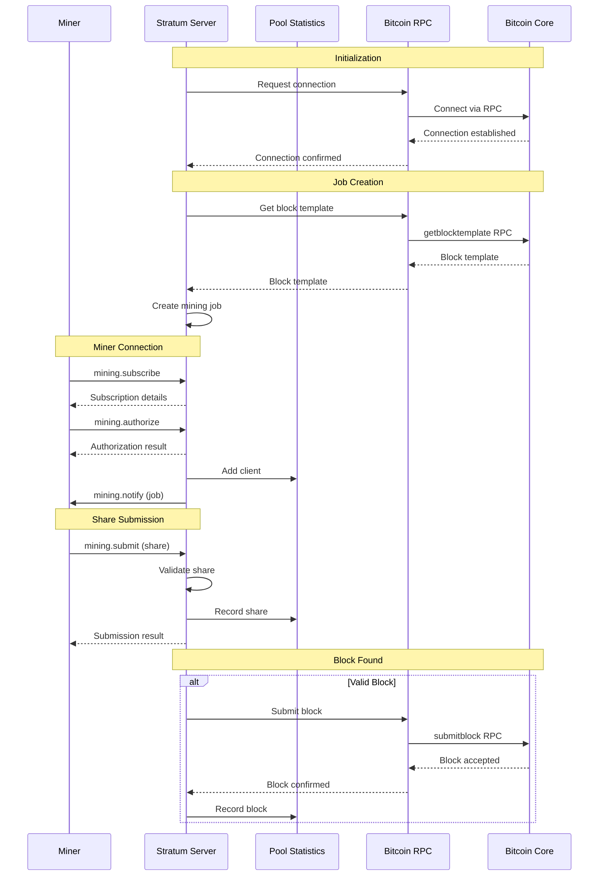
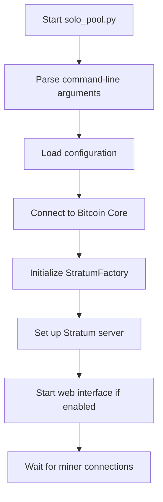

# System Architecture Overview

This document provides a high-level overview of the Bitcoin solo mining pool architecture, explaining how different components interact and the flow of data through the system.

## High-Level Components

The mining pool consists of several key components, each with specific responsibilities:



### Component Descriptions

1. **Bitcoin Core Node**: A full Bitcoin node that maintains a complete copy of the blockchain and provides block templates for mining.

2. **Bitcoin RPC Client (`bitcoin_rpc.py`)**: Communicates with the Bitcoin Core node using JSON-RPC to retrieve block templates and submit found blocks.

3. **Stratum Server (`stratum.py`)**: Implements the Stratum mining protocol to communicate with miners, distribute jobs, and collect shares.

4. **Pool Statistics (`pool_stats.py`)**: Tracks mining statistics including shares, hashrate, and connected miners.

5. **Difficulty Adjuster (`difficulty_adjuster.py`)**: Dynamically adjusts the difficulty for each miner based on their hashrate.

6. **Web Interface (`simple_web_interface.py`)**: Provides a web dashboard for monitoring pool performance.

## Data Flow Diagram

The following diagram illustrates how data flows through the mining pool system:



## Directory Structure

```
jool/
├── bitcoin_rpc.py       # Bitcoin Core RPC client
├── config.ini           # Configuration file
├── difficulty_adjuster.py # Difficulty adjustment logic
├── mining_utils.py      # Mining utilities
├── pool_stats.py        # Statistics tracking
├── requirements.txt     # Python dependencies
├── simple_web_interface.py # Web dashboard
├── solo_pool.py         # Main entry point
├── stratum.py           # Stratum protocol implementation
└── templates/           # HTML templates
    └── stats.html       # Dashboard template
```

## Key Technologies Used

1. **Python**: The entire application is written in Python, making it accessible for beginners.

2. **Twisted**: An event-driven networking framework used for the Stratum server implementation.

3. **JSON-RPC**: Used for communication with the Bitcoin Core node.

4. **Stratum Protocol**: A lightweight mining protocol for efficient communication with miners.

5. **HTTP**: Used for the web dashboard interface.

## Initialization Process



The initialization process begins in `solo_pool.py`, which:

1. Parses command-line arguments
2. Loads configuration from `config.ini`
3. Establishes a connection to the Bitcoin Core node
4. Initializes the Stratum server
5. Sets up the web interface if enabled
6. Waits for miner connections

## Code References

- **Main Entry Point**: `solo_pool.py` contains the initialization logic and command-line interface.
- **Configuration**: `config.ini` stores Bitcoin RPC connection details.
- **Stratum Implementation**: `stratum.py` contains the core mining pool logic.

## Next Steps

Now that you understand the overall architecture, let's dive deeper into the [Stratum Protocol](03-stratum-protocol.md) implementation, which is the heart of the mining pool.
