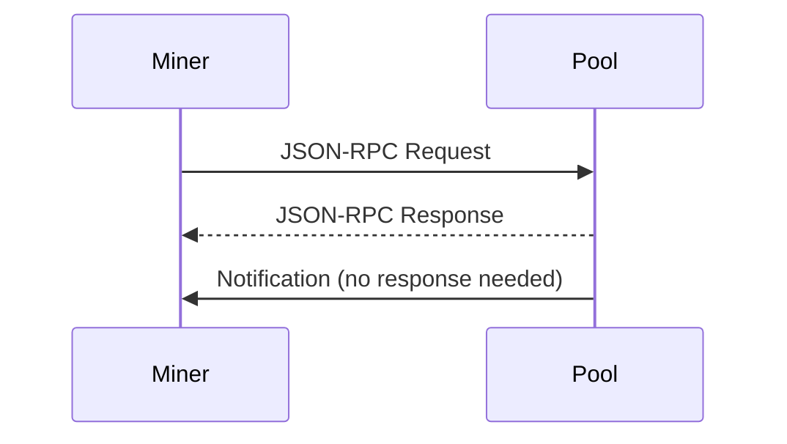
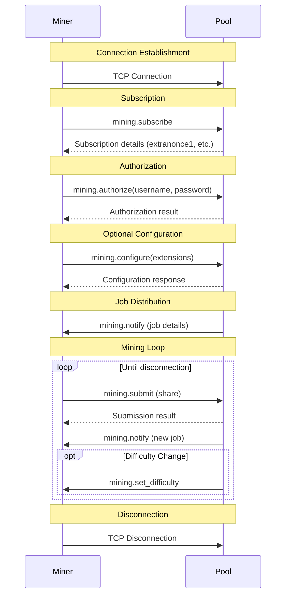
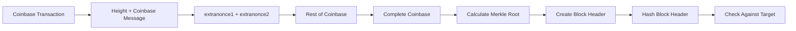
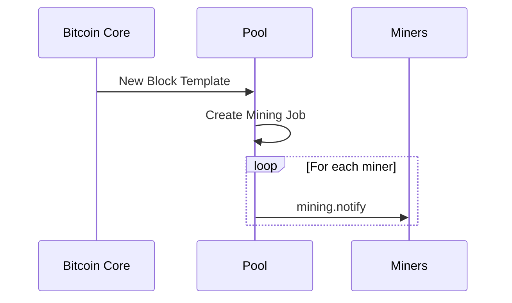

# Stratum Protocol Explained

The Stratum protocol is the communication protocol used between miners and the mining pool. Understanding this protocol is essential for implementing a mining pool.

## Protocol Basics

Stratum is a lightweight, JSON-based protocol that operates over a TCP connection. It uses a simple request-response pattern with notifications.



### Message Format

All Stratum messages are JSON objects with the following structure:

For **requests**:
```json
{
    "id": 1,
    "method": "method_name",
    "params": [param1, param2, ...]
}
```

For **responses**:
```json
{
    "id": 1,
    "result": result_value,
    "error": null
}
```

For **notifications** (no response expected):
```json
{
    "id": null,
    "method": "method_name",
    "params": [param1, param2, ...]
}
```

## Connection Lifecycle

The following diagram shows the typical lifecycle of a miner connection:



## Key Message Types

### 1. mining.subscribe

This is the first message sent by a miner to subscribe to the mining service.

**Request:**
```json
{
    "id": 1,
    "method": "mining.subscribe",
    "params": ["miner_user_agent", "protocol_version"]
}
```

**Response:**
```json
{
    "id": 1,
    "result": [
        [
            ["mining.set_difficulty", "subscription_id1"],
            ["mining.notify", "subscription_id2"]
        ],
        "extranonce1",
        "extranonce2_size"
    ],
    "error": null
}
```

In our code, this is handled by the `handle_subscribe` method in `stratum.py`:

```python
def handle_subscribe(self, message_id, params):
    # Generate a unique extranonce1 for this client
    extranonce1 = binascii.hexlify(os.urandom(4)).decode()
    self.extranonce1 = extranonce1
    self.extranonce2_size = 4  # Fixed size for simplicity
    
    # Send subscription response
    result = [
        [
            ["mining.set_difficulty", ""],
            ["mining.notify", ""]
        ],
        extranonce1,
        self.extranonce2_size
    ]
    self.send_result(message_id, result)
    
    # Log the subscription
    logger.info(f"Client {self.client_id} subscribed with extranonce1: {extranonce1}")
    
    # Send initial difficulty
    self.send_difficulty(self.difficulty)
    
    # Send initial job if available
    if self.factory.current_job:
        self.send_job(self.factory.current_job)
```

### 2. mining.authorize

Used by miners to authenticate themselves to the pool.

**Request:**
```json
{
    "id": 2,
    "method": "mining.authorize",
    "params": ["username", "password"]
}
```

**Response:**
```json
{
    "id": 2,
    "result": true,
    "error": null
}
```

### 3. mining.notify

Sent by the pool to notify miners of a new mining job.

**Notification:**
```json
{
    "id": null,
    "method": "mining.notify",
    "params": [
        "job_id",
        "prevhash",
        "coinbase1",
        "coinbase2",
        ["merkle_branch1", "merkle_branch2", ...],
        "version",
        "nbits",
        "ntime",
        "clean_jobs"
    ]
}
```

### 4. mining.submit

Sent by miners to submit a share or block solution.

**Request:**
```json
{
    "id": 4,
    "method": "mining.submit",
    "params": [
        "worker_name",
        "job_id",
        "extranonce2",
        "ntime",
        "nonce"
    ]
}
```

**Response:**
```json
{
    "id": 4,
    "result": true,
    "error": null
}
```

In our code, this is handled by the `handle_submit` method in `stratum.py`:

```python
def handle_submit(self, message_id, params):
    # Extract parameters
    worker_name = params[0]
    job_id = params[1]
    extranonce2 = params[2]
    time_hex = params[3]
    nonce_hex = params[4]
    
    # Log the submission
    logger.debug(f"Share submission from {worker_name}: job_id={job_id}, extranonce2={extranonce2}, time={time_hex}, nonce={nonce_hex}")
    
    # Record share time
    share_time = time.time()
    
    # For testing, always accept shares
    self.factory.stats.add_share(worker_name, valid=True, difficulty=self.difficulty)
    self.send_result(message_id, True)
    
    # Process the submission to check if it would have been valid
    result = self.factory.process_submission(
        job_id, self.extranonce1, extranonce2, time_hex, nonce_hex, 
        self.difficulty, worker_name
    )
    
    if not result['valid']:
        logger.warning(f"Share would have been invalid: {result['error']}")
```

### 5. mining.set_difficulty

Sent by the pool to adjust the difficulty target for a miner.

**Notification:**
```json
{
    "id": null,
    "method": "mining.set_difficulty",
    "params": [difficulty]
}
```

## Extranonce Mechanism

The extranonce is a critical part of the mining process:

1. **extranonce1**: Assigned by the pool to each miner during subscription
2. **extranonce2**: Generated by the miner for each share submission

Together, they ensure that each miner works on a unique search space, preventing duplicate work:



## Job Distribution

When a new block template is received from Bitcoin Core, the pool creates a new mining job and distributes it to all connected miners:



## Code References

The Stratum protocol implementation can be found in `stratum.py`, which defines two main classes:

1. **StratumProtocol**: Handles individual miner connections
2. **StratumFactory**: Manages all connections and coordinates job distribution

Key methods to examine:

- `StratumProtocol.connectionMade`: Called when a miner connects
- `StratumProtocol.dataReceived`: Processes incoming messages
- `StratumProtocol.handle_subscribe`: Handles subscription requests
- `StratumProtocol.handle_authorize`: Handles authorization requests
- `StratumProtocol.handle_submit`: Processes share submissions
- `StratumFactory.update_block`: Creates new mining jobs when a new block is detected

## Next Steps

Now that you understand the Stratum protocol, let's explore how [Mining Jobs](04-mining-jobs.md) are created and processed.
