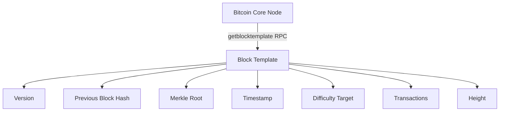
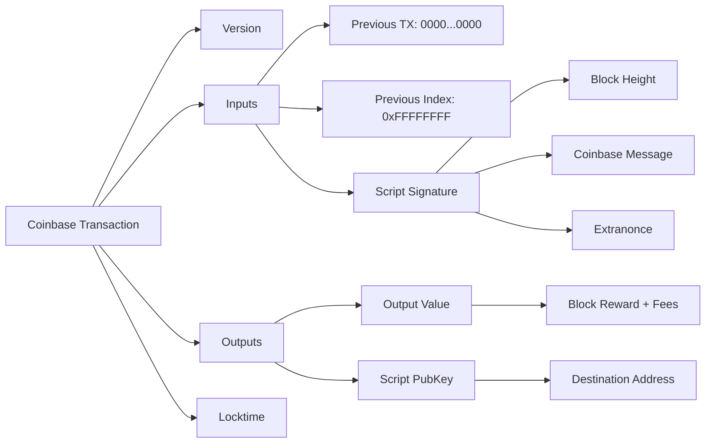
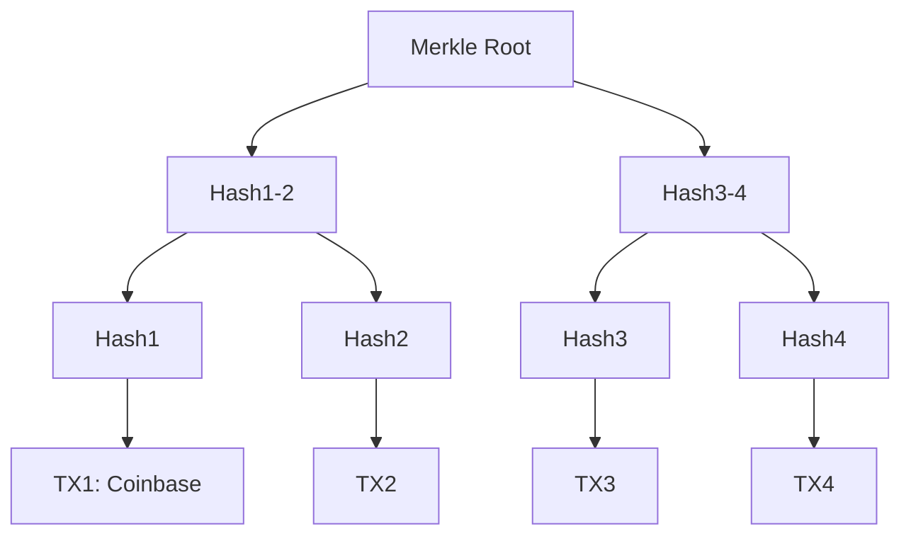
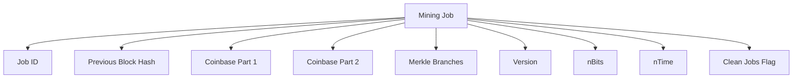
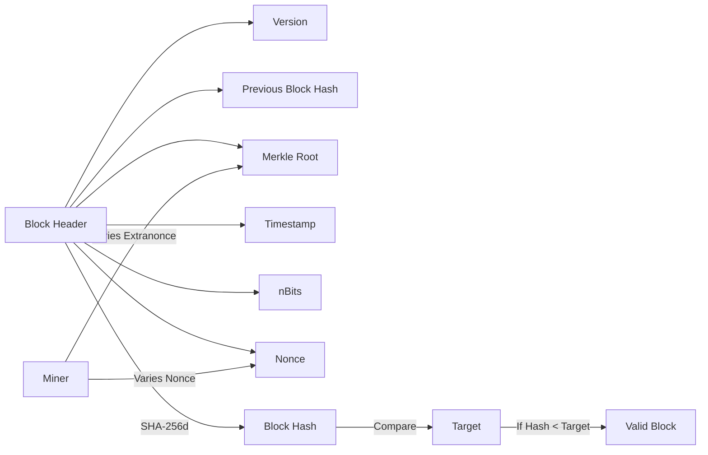
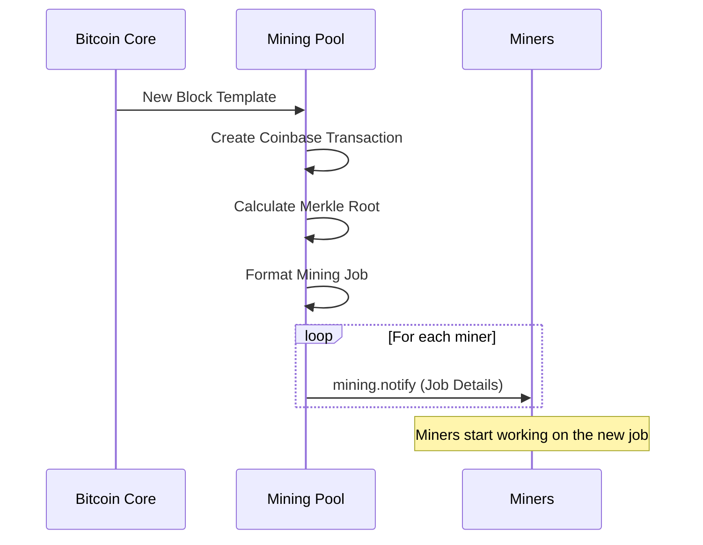

# Mining Job Creation

Mining jobs are at the core of the mining pool's operation. This document explains how mining jobs are created, structured, and distributed to miners.

## Block Templates

The mining process starts with obtaining a block template from the Bitcoin Core node. A block template contains all the information needed to construct a candidate block:



In our code, we retrieve block templates using the `get_block_template` method in `bitcoin_rpc.py`:

```python
def get_block_template(self):
    """Get a block template for mining"""
    try:
        template = self.rpc.getblocktemplate({'rules': ['segwit']})
        return template
    except Exception as e:
        logger.error(f"Error getting block template: {str(e)}")
        return None
```

## Coinbase Transactions

The coinbase transaction is the first transaction in a block and is created by the miner. It includes:

1. The block reward (newly created bitcoins)
2. Transaction fees from all transactions in the block
3. The block height (required by BIP34)
4. An arbitrary data field (coinbase message)



In our implementation, the coinbase transaction is created in the `create_coinbase` function in `mining_utils.py`:

```python
def create_coinbase(height, coinbase_value, coinbase_message, address):
    """Create a coinbase transaction"""
    # Coinbase input script contains the block height and arbitrary data
    script_sig = (
        # Height (BIP34)
        bytes([len(struct.pack('<I', height))]) + 
        struct.pack('<I', height) +
        # Arbitrary data (limited to 100 bytes)
        bytes([min(len(coinbase_message), 100)]) + 
        coinbase_message[:100]
    )
    
    # Create the transaction
    coinbase = struct.pack('<I', 1)  # Version
    coinbase += bytes([1])  # Number of inputs
    coinbase += bytes([0] * 32)  # Previous output hash (null for coinbase)
    coinbase += struct.pack('<I', 0xFFFFFFFF)  # Previous output index
    coinbase += bytes([len(script_sig)])  # Script length
    coinbase += script_sig  # Script sig
    coinbase += struct.pack('<I', 0)  # Sequence
    coinbase += bytes([1])  # Number of outputs
    coinbase += struct.pack('<Q', coinbase_value)  # Output value
    
    # P2PKH script for the destination address
    script_pubkey = bytes.fromhex('76a91488ac')  # Placeholder script
    
    coinbase += bytes([len(script_pubkey)])  # Script length
    coinbase += script_pubkey  # Script pubkey
    coinbase += struct.pack('<I', 0)  # Lock time
    
    return binascii.hexlify(coinbase).decode()
```

## Merkle Trees

Transactions in a block are organized into a Merkle tree, with the Merkle root included in the block header. This allows efficient verification of transaction inclusion.



The Merkle root is calculated in the `calculate_merkle_root` function in `mining_utils.py`:

```python
def calculate_merkle_root(txids):
    """Calculate the Merkle root from a list of transaction IDs"""
    if not txids:
        return None
    
    if len(txids) == 1:
        return txids[0]
    
    # Ensure even number of transactions by duplicating the last one if needed
    if len(txids) % 2 == 1:
        txids.append(txids[-1])
    
    # Pair transactions and hash them
    new_txids = []
    for i in range(0, len(txids), 2):
        txid1 = binascii.unhexlify(txids[i])
        txid2 = binascii.unhexlify(txids[i+1])
        combined = txid1 + txid2
        hash_result = hashlib.sha256(hashlib.sha256(combined).digest()).digest()
        new_txids.append(binascii.hexlify(hash_result).decode())
    
    # Recursively calculate the Merkle root
    return calculate_merkle_root(new_txids)
```

## Mining Job Structure

A mining job in the Stratum protocol consists of the following components:



In our implementation, mining jobs are created in the `create_mining_job` function in `mining_utils.py` and then formatted for Stratum in the `StratumFactory.update_block` method in `stratum.py`.

## Proof-of-Work

The mining process involves finding a block header hash that is below the target difficulty. This is done by varying the nonce and extranonce values.



The proof-of-work validation is implemented in the `is_valid_proof_of_work` function in `mining_utils.py`:

```python
def is_valid_proof_of_work(block_hash, target):
    """Check if a block hash meets the target difficulty"""
    hash_int = int.from_bytes(block_hash, byteorder='little')
    return hash_int <= target
```

## Job Distribution Flow

When a new block template is received, the following process occurs:



In our code, this flow is implemented in the `StratumFactory.update_block` method in `stratum.py`:

```python
def update_block(self):
    """Update the current block template and notify clients"""
    try:
        # Get a new block template
        template = self.bitcoin_rpc.get_block_template()
        if not template:
            logger.error("Failed to get block template")
            return False
        
        height = template.get('height', 0)
        logger.info(f"New block template received at height {height}")
        
        # Create a new mining job
        job = create_mining_job(template, self.coinbase_message, self.pool_address)
        
        # Store the job with a unique ID
        job_id = binascii.hexlify(os.urandom(4)).decode()
        self.jobs[job_id] = job
        self.current_job = job_id
        
        # Notify all connected clients
        for client in self.clients.values():
            client.send_job(job_id)
        
        return True
    except Exception as e:
        logger.error(f"Error updating block: {str(e)}")
        return False
```

## Code References

The key files to examine for understanding mining job creation are:

1. `mining_utils.py`: Contains functions for creating coinbase transactions, calculating Merkle roots, and validating proof-of-work.
2. `stratum.py`: Implements job distribution through the Stratum protocol.
3. `bitcoin_rpc.py`: Handles communication with the Bitcoin Core node to retrieve block templates.

## Next Steps

Now that you understand how mining jobs are created and distributed, let's explore [Share Validation and Difficulty](05-share-validation.md) to understand how miners' work is validated and rewarded.
