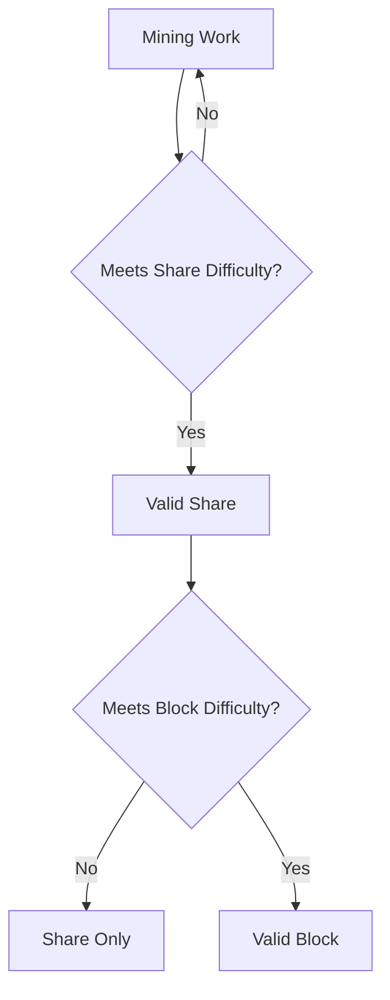
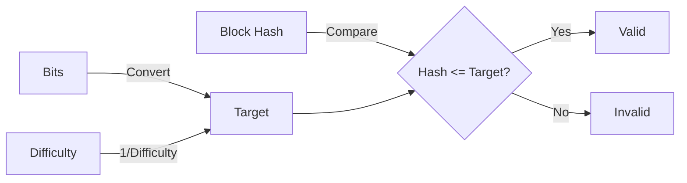
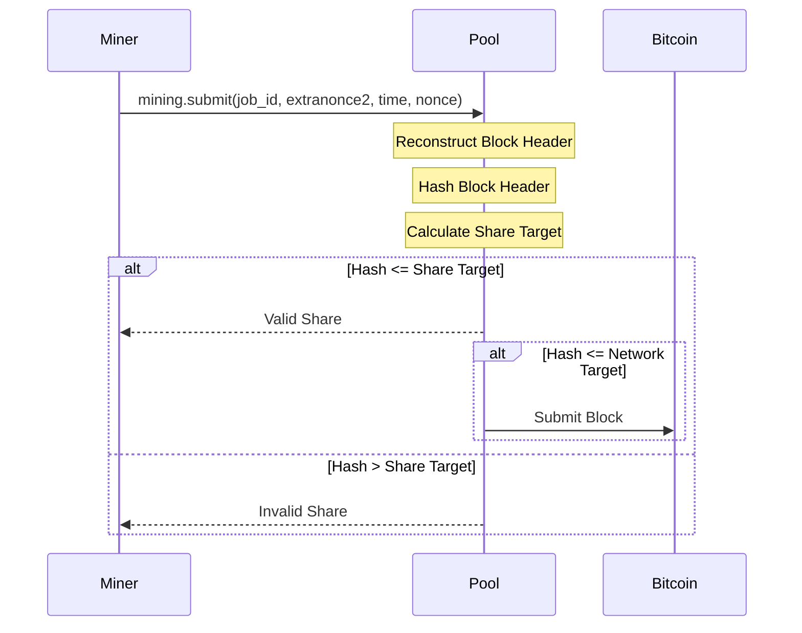
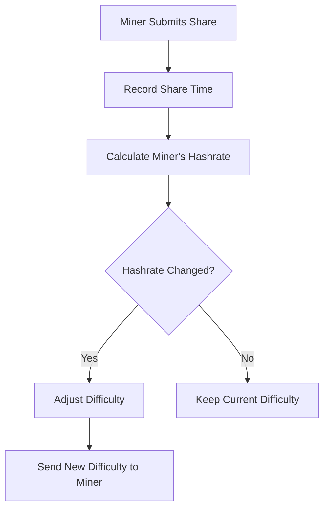
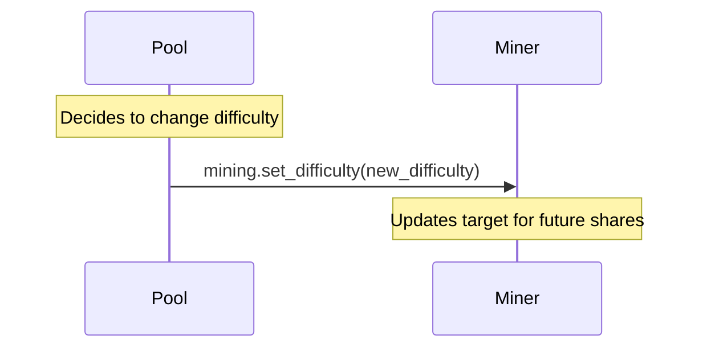

# Share Validation and Difficulty

Understanding share validation and difficulty adjustment is crucial for a mining pool implementation. This document explains how shares are validated, how difficulty is calculated, and how variable difficulty adjustment works.

## Shares vs. Blocks

In Bitcoin mining, miners are searching for a block hash that meets the network difficulty target. However, this is a rare event, so mining pools introduce the concept of "shares" - proofs of work that meet a lower difficulty target.



- **Shares**: Proofs of work that meet the pool's lower difficulty target
- **Blocks**: Shares that also meet the Bitcoin network's higher difficulty target

## Target Calculation

The target is a 256-bit number that the block hash must be less than or equal to. It's derived from the "bits" field in the block header.



In our code, the target is calculated in the `bits_to_target` function in `mining_utils.py`:

```python
def bits_to_target(bits):
    """Convert compact bits representation to target"""
    exp = bits >> 24
    mant = bits & 0xFFFFFF
    if mant > 0x7FFFFF:
        mant = 0x7FFFFF
    target = mant * (1 << (8 * (exp - 3)))
    return target
```

## Share Validation Process

When a miner submits a share, the pool needs to validate it by:

1. Reconstructing the block header using the submitted parameters
2. Hashing the header
3. Comparing the hash against the share target



In our implementation, share validation is performed in the `process_submission` method in `stratum.py`:

```python
def process_submission(self, job_id, extranonce1, extranonce2, time_hex, nonce_hex, difficulty, worker_name):
    """Process a share submission and check if it's valid"""
    try:
        # Check if job exists
        if job_id not in self.jobs:
            return {'valid': False, 'error': 'Job not found'}
        
        job = self.jobs[job_id]
        
        # Reconstruct the block header
        version = job['version']
        prev_hash = job['prev_block_hash']
        merkle_root = job['merkle_root']
        nbits = job['bits']
        
        # Convert parameters to correct format
        time_int = int(time_hex, 16)
        nonce_int = int(nonce_hex, 16)
        
        # Reconstruct coinbase with extranonce
        coinbase_hex = job['coinbase']
        
        # Hash the block header
        header = create_block_header(version, prev_hash, merkle_root, time_int, nbits, nonce_int)
        hash_result = hash_block_header(header)
        hash_int = int.from_bytes(hash_result, byteorder='little')
        hash_hex = binascii.hexlify(hash_result).decode()
        
        # Calculate targets
        pdiff_1_target = 0x00000000FFFF0000000000000000000000000000000000000000000000000000
        share_target = int(pdiff_1_target / difficulty)
        network_target = bits_to_target(nbits)
        
        # Check if hash meets targets
        valid_share = hash_int <= share_target
        valid_block = hash_int <= network_target
        
        if valid_share:
            if valid_block:
                # Found a block! Submit it to the Bitcoin network
                block_hex = self.create_block_hex(job, header)
                submit_result = self.bitcoin_rpc.submit_block(block_hex)
                
                if submit_result is None:
                    logger.info(f"Block found and accepted! Height: {job['height']}, Hash: {hash_hex}")
                    self.stats.add_block(worker_name)
                    return {'valid': True, 'block': True}
                else:
                    logger.warning(f"Block found but rejected: {submit_result}")
                    return {'valid': True, 'block': False, 'error': submit_result}
            else:
                return {'valid': True}
        else:
            return {'valid': False, 'error': f'Share did not meet target difficulty (hash: {hash_hex}, target: {share_target})'}
    except Exception as e:
        logger.error(f"Error processing submission: {str(e)}")
        return {'valid': False, 'error': str(e)}
```

## Difficulty and Target Relationship

The relationship between difficulty and target is inverse:

```
target = difficulty_1_target / difficulty
```

Where `difficulty_1_target` is the target for difficulty 1, which is:

```
0x00000000FFFF0000000000000000000000000000000000000000000000000000
```

This means:
- Higher difficulty = Lower target = Harder to find a valid hash
- Lower difficulty = Higher target = Easier to find a valid hash

## Variable Difficulty Adjustment

To optimize mining efficiency, pools often implement variable difficulty adjustment. This adjusts each miner's share difficulty based on their hashrate.



In our implementation, this is handled by the `DifficultyAdjuster` class in `difficulty_adjuster.py`:

```python
def suggest_difficulty(self, client_id, current_difficulty, suggested_difficulty=None):
    """
    Suggest a new difficulty for a client based on their hashrate
    If suggested_difficulty is provided, use that instead of calculating
    """
    # If client suggests a difficulty, use it (for testing)
    if suggested_difficulty is not None:
        logger.info(f"Using suggested difficulty {suggested_difficulty} for client {client_id}")
        return suggested_difficulty
    
    # Get client stats
    with self.lock:
        if client_id not in self.client_stats:
            # New client, start with default difficulty
            self.client_stats[client_id] = {
                'last_share_time': time.time(),
                'share_count': 0,
                'current_difficulty': current_difficulty
            }
            return current_difficulty
        
        # Calculate time since last difficulty adjustment
        client_stats = self.client_stats[client_id]
        current_time = time.time()
        time_diff = current_time - client_stats['last_share_time']
        
        # Update stats
        client_stats['last_share_time'] = current_time
        client_stats['share_count'] += 1
        
        # Only adjust difficulty after enough shares or time
        if client_stats['share_count'] < self.min_shares and time_diff < self.adjustment_interval:
            return current_difficulty
        
        # Calculate hashrate (shares * difficulty / time)
        if time_diff > 0:
            hashrate = (client_stats['share_count'] * current_difficulty) / time_diff
            
            # Calculate ideal difficulty (hashrate * target_time)
            ideal_difficulty = hashrate * self.target_share_time
            
            # Limit difficulty changes
            new_difficulty = min(
                max(
                    current_difficulty * self.min_adjustment,
                    min(ideal_difficulty, current_difficulty * self.max_adjustment)
                ),
                self.max_difficulty
            )
            
            # Ensure minimum difficulty
            new_difficulty = max(new_difficulty, self.min_difficulty)
            
            # Reset share counter
            client_stats['share_count'] = 0
            client_stats['current_difficulty'] = new_difficulty
            
            logger.debug(f"Adjusted difficulty for {client_id}: {current_difficulty} -> {new_difficulty} (hashrate: {hashrate} H/s)")
            return new_difficulty
        
        return current_difficulty
```

## Difficulty Notification

When the pool adjusts a miner's difficulty, it sends a `mining.set_difficulty` notification:



In our code, this is implemented in the `send_difficulty` method in `stratum.py`:

```python
def send_difficulty(self, difficulty):
    """Send difficulty to the client"""
    self.difficulty = difficulty
    self.send_notification("mining.set_difficulty", [difficulty])
```

## Code References

The key files for understanding share validation and difficulty adjustment are:

1. `stratum.py`: Contains the `process_submission` method for validating shares
2. `difficulty_adjuster.py`: Implements the variable difficulty adjustment logic
3. `mining_utils.py`: Provides utility functions for target calculation and block hashing

## Next Steps

Now that you understand how shares are validated and difficulty is adjusted, let's explore how [Statistics and Monitoring](06-statistics.md) are implemented in the mining pool.
