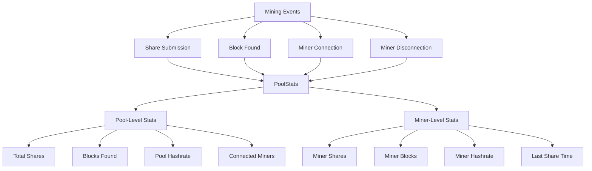
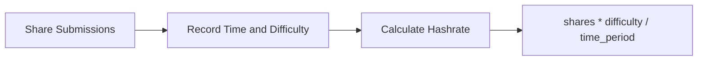
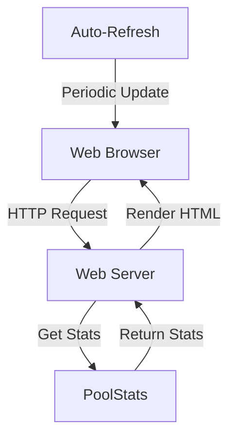
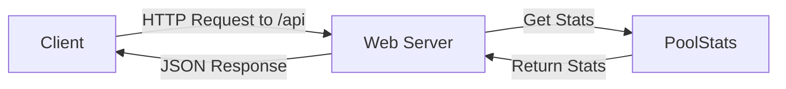
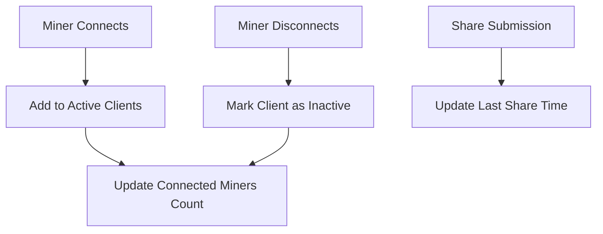

# Statistics and Monitoring

Tracking and displaying mining statistics is an essential part of a mining pool. This document explains how statistics are collected, calculated, and presented to users through the web dashboard.

## Statistics Collection

The mining pool tracks various statistics at both the pool and individual miner levels.



In our implementation, statistics are managed by the `PoolStats` class in `pool_stats.py`:

```python
class PoolStats:
    """Class to track mining pool statistics"""
    
    def __init__(self):
        """Initialize statistics"""
        self.lock = threading.RLock()
        self.start_time = time.time()
        self.shares = {'valid': 0, 'invalid': 0, 'stale': 0}
        self.blocks_found = 0
        self.clients = {}
        self.share_times = []
        
    def add_share(self, worker_name, valid=True, stale=False, difficulty=1):
        """Add a share to statistics"""
        with self.lock:
            current_time = time.time()
            
            # Update global shares
            if valid:
                self.shares['valid'] += 1
                # Record share time for hashrate calculation
                self.share_times.append((current_time, difficulty))
                # Clean up old share times
                self.share_times = [st for st in self.share_times if current_time - st[0] < 600]
            elif stale:
                self.shares['stale'] += 1
            else:
                self.shares['invalid'] += 1
            
            # Update worker shares
            if worker_name:
                if worker_name not in self.clients:
                    self.clients[worker_name] = {
                        'shares': {'valid': 0, 'invalid': 0, 'stale': 0},
                        'last_share_time': current_time,
                        'connection_time': current_time,
                        'difficulty': difficulty,
                        'active': True
                    }
                self.clients[worker_name]['shares']['valid'] += 1
                self.clients[worker_name]['last_share_time'] = current_time
```

## Hashrate Calculation

Hashrate is calculated based on the number and difficulty of shares submitted over time:



In our code, hashrate is calculated in the `calculate_hashrate` method in `pool_stats.py`:

```python
def calculate_hashrate(self):
    """Calculate current hashrate based on shares in the last 10 minutes"""
    with self.lock:
        current_time = time.time()
        
        # Filter shares from the last 10 minutes
        recent_shares = [s for s in self.share_times if current_time - s[0] < 600]
        
        if not recent_shares:
            return 0
        
        # Calculate time period
        oldest_time = min(s[0] for s in recent_shares)
        time_period = current_time - oldest_time
        
        if time_period <= 0:
            return 0
        
        # Calculate total difficulty
        total_difficulty = sum(s[1] for s in recent_shares)
        
        # Hashrate = (shares * difficulty * 2^32) / time_period
        hashrate = (total_difficulty * 4294967296) / time_period
        
        return hashrate
```

## Web Dashboard

The web dashboard provides a visual interface for monitoring pool and miner statistics.



The dashboard is implemented in `simple_web_interface.py` and uses a simple HTML template to display statistics:

```python
class StatsResource(resource.Resource):
    """Resource for HTML statistics page"""
    isLeaf = True
    
    def __init__(self, factory):
        resource.Resource.__init__(self)
        self.factory = factory
    
    def render_GET(self, request):
        """Render HTML statistics page"""
        request.setHeader(b"content-type", b"text/html; charset=utf-8")
        
        # Get pool stats
        pool_stats = self.factory.stats.get_pool_stats()
        
        # Get worker stats
        worker_stats = self.factory.stats.get_worker_stats()
        
        # Format hashrate
        hashrate = format_hashrate(pool_stats.get('hashrate', 0))
        
        # Format uptime
        uptime = format_time(pool_stats.get('uptime', 0))
        
        # Format worker stats table
        worker_rows = ""
        for worker_name, stats in worker_stats.items():
            # Skip IP-based entries
            if worker_name.startswith('192.168.'):
                continue
                
            worker_hashrate = format_hashrate(stats.get('hashrate', 0))
            last_share = format_time_ago(stats.get('last_share_time', 0))
            valid_shares = stats.get('shares', {}).get('valid', 0)
            invalid_shares = stats.get('shares', {}).get('invalid', 0)
            
            worker_rows += f"""
            <tr>
                <td>{worker_name}</td>
                <td>{worker_hashrate}</td>
                <td>{valid_shares}</td>
                <td>{invalid_shares}</td>
                <td>{last_share}</td>
            </tr>
            """
        
        # Build HTML response
        html = f"""
        <!DOCTYPE html>
        <html>
        <head>
            <title>Bitcoin Solo Mining Pool Statistics</title>
            <meta name="viewport" content="width=device-width, initial-scale=1.0">
            <style>
                body {{ font-family: Arial, sans-serif; margin: 0; padding: 20px; background-color: #f5f5f5; }}
                h1, h2 {{ color: #333; }}
                .container {{ max-width: 1200px; margin: 0 auto; }}
                .card {{ background: white; border-radius: 5px; box-shadow: 0 2px 5px rgba(0,0,0,0.1); padding: 20px; margin-bottom: 20px; }}
                .stats-grid {{ display: grid; grid-template-columns: repeat(auto-fill, minmax(200px, 1fr)); gap: 15px; margin-bottom: 20px; }}
                .stat-box {{ background: #f9f9f9; border-radius: 5px; padding: 15px; text-align: center; }}
                .stat-value {{ font-size: 24px; font-weight: bold; margin: 10px 0; color: #0066cc; }}
                .stat-label {{ font-size: 14px; color: #666; }}
                table {{ width: 100%; border-collapse: collapse; }}
                th, td {{ padding: 12px 15px; text-align: left; border-bottom: 1px solid #ddd; }}
                th {{ background-color: #f2f2f2; }}
                tr:hover {{ background-color: #f5f5f5; }}
                .refresh-controls {{ margin-bottom: 20px; }}
                select, button {{ padding: 8px 12px; margin-right: 10px; }}
            </style>
            <script>
                function setAutoRefresh() {{
                    const interval = document.getElementById('refresh-interval').value;
                    if (interval > 0) {{
                        if (window.refreshTimer) clearInterval(window.refreshTimer);
                        window.refreshTimer = setInterval(() => location.reload(), interval * 1000);
                    }} else {{
                        if (window.refreshTimer) clearInterval(window.refreshTimer);
                    }}
                }}
                
                window.onload = function() {{
                    const interval = document.getElementById('refresh-interval').value;
                    if (interval > 0) {{
                        window.refreshTimer = setInterval(() => location.reload(), interval * 1000);
                    }}
                }};
            </script>
        </head>
        <body>
            <div class="container">
                <h1>Bitcoin Solo Mining Pool Statistics</h1>
                
                <div class="refresh-controls card">
                    <label for="refresh-interval">Auto-refresh: </label>
                    <select id="refresh-interval" onchange="setAutoRefresh()">
                        <option value="0">Off</option>
                        <option value="5" selected>5 seconds</option>
                        <option value="10">10 seconds</option>
                        <option value="30">30 seconds</option>
                        <option value="60">1 minute</option>
                    </select>
                    <button onclick="location.reload()">Refresh Now</button>
                </div>
                
                <div class="card">
                    <h2>Pool Statistics</h2>
                    <div class="stats-grid">
                        <div class="stat-box">
                            <div class="stat-label">Hashrate</div>
                            <div class="stat-value">{hashrate}</div>
                        </div>
                        <div class="stat-box">
                            <div class="stat-label">Valid Shares</div>
                            <div class="stat-value">{pool_stats.get('valid_shares', 0)}</div>
                        </div>
                        <div class="stat-box">
                            <div class="stat-label">Blocks Found</div>
                            <div class="stat-value">{pool_stats.get('blocks_found', 0)}</div>
                        </div>
                        <div class="stat-box">
                            <div class="stat-label">Connected Miners</div>
                            <div class="stat-value">{pool_stats.get('connected_miners', 0)}</div>
                        </div>
                        <div class="stat-box">
                            <div class="stat-label">Uptime</div>
                            <div class="stat-value">{uptime}</div>
                        </div>
                    </div>
                </div>
                
                <div class="card">
                    <h2>Worker Statistics</h2>
                    <table>
                        <thead>
                            <tr>
                                <th>Worker</th>
                                <th>Hashrate</th>
                                <th>Valid Shares</th>
                                <th>Invalid Shares</th>
                                <th>Last Share</th>
                            </tr>
                        </thead>
                        <tbody>
                            {worker_rows}
                        </tbody>
                    </table>
                </div>
            </div>
        </body>
        </html>
        """
        
        return html.encode('utf-8')
```

## JSON API

In addition to the HTML dashboard, the mining pool provides a JSON API for programmatic access to statistics.



The JSON API is implemented in the `JSONStatsResource` class in `simple_web_interface.py`:

```python
class JSONStatsResource(resource.Resource):
    """Resource for JSON API access to pool statistics"""
    isLeaf = True
    
    def __init__(self, factory):
        resource.Resource.__init__(self)
        self.factory = factory
    
    def render_GET(self, request):
        """Render JSON API response"""
        request.setHeader(b"content-type", b"application/json; charset=utf-8")
        
        # Get pool stats
        pool_stats = self.factory.stats.get_pool_stats()
        
        # Get worker stats
        worker_stats = self.factory.stats.get_worker_stats()
        
        # Format worker stats for JSON
        formatted_workers = {}
        for worker_name, stats in worker_stats.items():
            formatted_workers[worker_name] = {
                'valid_shares': stats.get('shares', {}).get('valid', 0),
                'invalid_shares': stats.get('shares', {}).get('invalid', 0),
                'blocks_found': stats.get('blocks_found', 0),
                'hashrate': stats.get('hashrate', 0),
                'last_share_time': stats.get('last_share_time', 0)
            }
        
        # Build response
        response = {
            'pool': {
                'hashrate': pool_stats.get('hashrate', 0),
                'total_shares': pool_stats.get('total_shares', 0),
                'valid_shares': pool_stats.get('valid_shares', 0),
                'invalid_shares': pool_stats.get('invalid_shares', 0),
                'blocks_found': pool_stats.get('blocks_found', 0),
                'connected_miners': pool_stats.get('connected_miners', 0),
                'uptime': pool_stats.get('uptime', 0)
            },
            'workers': formatted_workers,
            'timestamp': int(time.time())
        }
        
        return json.dumps(response, indent=4).encode('utf-8')
```

## Client Tracking

Tracking connected miners is an important aspect of pool statistics. The pool keeps track of:

1. When miners connect
2. When miners disconnect
3. Which miners are currently active



In our implementation, client tracking is handled in the `add_client` and `remove_client` methods in `pool_stats.py`:

```python
def add_client(self, client_id, worker_name=None):
    """Add a new client to statistics"""
    with self.lock:
        key = worker_name or client_id
        if key not in self.clients:
            self.clients[key] = {
                'shares': {'valid': 0, 'invalid': 0, 'stale': 0},
                'last_share_time': 0,
                'connection_time': time.time(),
                'difficulty': 1,
                'active': True,
                'client_ids': [client_id]
            }
        else:
            # If client exists but was marked inactive, reactivate it
            self.clients[key]['active'] = True
            # Add client_id to the list if not already present
            if client_id not in self.clients[key].get('client_ids', []):
                if 'client_ids' not in self.clients[key]:
                    self.clients[key]['client_ids'] = []
                self.clients[key]['client_ids'].append(client_id)

def remove_client(self, worker_name):
    """Remove a client from active statistics"""
    with self.lock:
        if worker_name in self.clients:
            self.clients[worker_name]['active'] = False
```

## Statistics API

The `PoolStats` class provides methods for retrieving statistics for both the web interface and internal use:

```python
def get_pool_stats(self):
    """Get pool statistics for the web interface"""
    with self.lock:
        current_time = time.time()
        
        # Calculate total shares
        total_shares = self.shares['valid'] + self.shares['invalid'] + self.shares['stale']
        
        # Get current hashrate
        hashrate = self.calculate_hashrate()
        
        # Count active miners - only count workers, not connections
        active_miners = len([name for name, data in self.clients.items() 
                           if data.get('active', True) and not name.startswith('192.168.')])
        
        return {
            'hashrate': hashrate,
            'total_shares': total_shares,
            'valid_shares': self.shares['valid'],
            'invalid_shares': self.shares['invalid'],
            'blocks_found': self.blocks_found,
            'connected_miners': active_miners,
            'uptime': current_time - self.start_time
        }

def get_worker_stats(self):
    """Get statistics for individual workers"""
    with self.lock:
        current_time = time.time()
        worker_stats = {}
        
        for worker_name, data in self.clients.items():
            if data.get('active', True):
                # Calculate worker hashrate
                hashrate = self.calculate_worker_hashrate(worker_name)
                
                worker_stats[worker_name] = {
                    'shares': data['shares'],
                    'hashrate': hashrate,
                    'last_share_time': data['last_share_time'],
                    'connection_time': data['connection_time'],
                    'blocks_found': 0  # We don't track blocks per worker in this simple implementation
                }
        
        return worker_stats
```

## Code References

The key files for understanding statistics and monitoring are:

1. `pool_stats.py`: Implements the core statistics tracking functionality
2. `simple_web_interface.py`: Provides the web dashboard and JSON API
3. `stratum.py`: Integrates with the statistics system to record events

## Conclusion

This completes our tour of the Bitcoin solo mining pool implementation. You should now have a good understanding of:

1. How Bitcoin mining works
2. The architecture of a mining pool
3. The Stratum protocol for miner communication
4. How mining jobs are created and distributed
5. How shares are validated and difficulty is adjusted
6. How statistics are tracked and displayed

With this knowledge, you can now explore the codebase in more detail, make improvements, or even build your own mining pool implementation.

Remember that running a mining pool requires a good understanding of Bitcoin, networking, and security. Always ensure that your implementation follows best practices and is secure before deploying it in a production environment.
